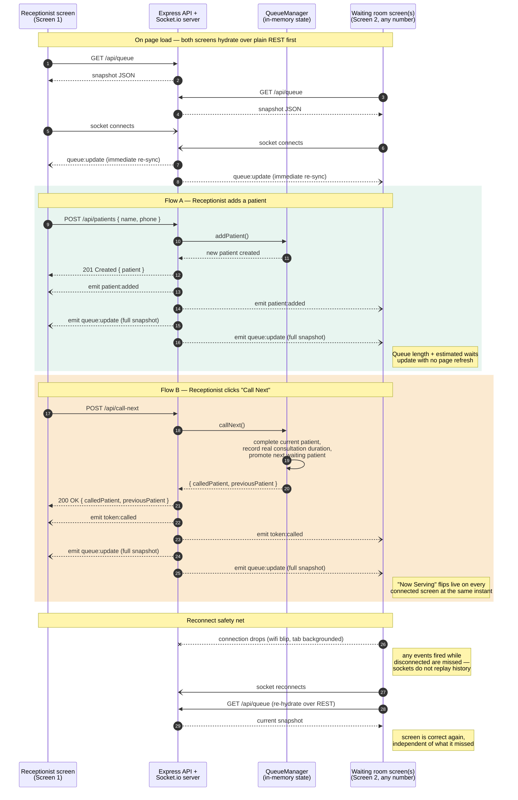

# Socket Event Diagram

This is the exact sequence of HTTP and Socket.io traffic behind the one
feature the brief weights highest: **both screens updating the instant
"Call Next" is clicked, with no refresh.**

A rendered copy is at [`socket-event-diagram.png`](./socket-event-diagram.png).
The source below renders natively if you're reading this on GitHub.



## Why REST *and* sockets, not sockets alone

REST is the source of truth for **state on load and on reconnect**.
Socket.io is the channel for **live deltas while connected**. A socket-only
design looks identical in a demo but silently breaks the first time a
screen's wifi blips — it has no way to ask "what did I miss?" Sockets don't
replay history, so the fix is structural, not a retry loop: always hydrate
over REST first, then trust the socket only for as long as it's actually
connected (see the `connect`/`reconnect` handling in
[`useQueueSocket.js`](../frontend/src/hooks/useQueueSocket.js)).

## Event reference

| Event | Direction | Fired when | Payload | Who listens |
|---|---|---|---|---|
| `patient:added` | server → all clients | A new patient is added to the queue | `{ patient }` | Either screen, for toast/sound hooks |
| `token:called` | server → all clients | "Call Next" is clicked | `{ calledPatient, previousPatient }` | Either screen, for toast/sound hooks |
| `patient:skipped` | server → all clients | A waiting patient is marked no-show | `{ patient }` | Either screen |
| `settings:updated` | server → all clients | Receptionist sets the average consultation time | `{ manualAverageMinutes }` | Receptionist screen |
| `queue:reset` | server → all clients | Queue is reset (demo/admin utility) | `{}` | Either screen |
| `queue:update` | server → all clients | **After every event above, always** | full snapshot (see below) | Both screens render entirely from this — the specific events above are optional enrichment, never required for correctness |
| `connect` / `disconnect` | built-in (Socket.io) | Transport-level | — | Drives the "Live" / "Reconnecting…" badge on both screens |

`queue:update` payload shape (from `QueueManager.getSnapshot()`):

```jsonc
{
  "currentToken": { "id": "...", "tokenNumber": 4, "name": "Ananya", "status": "in-consultation", "calledAt": "..." } | null,
  "waiting": [
    { "id": "...", "tokenNumber": 5, "name": "Priya", "tokensAhead": 0, "estimatedWaitMinutes": 4, "status": "waiting" }
  ],
  "queueLength": 3,
  "averageConsultationMinutes": 4.2,
  "averageSource": "live-data" | "manual-default",
  "manualAverageMinutes": 5,
  "sampleSize": 7,
  "totalServedToday": 12,
  "updatedAt": "2026-06-21T09:41:03.000Z"
}
```

Sending the **full snapshot** on every change — rather than having each
screen patch its own local state from small deltas — is a deliberate
simplification: there is exactly one place (`getSnapshot()`) that computes
"what should be on screen right now," so the receptionist desk and every
waiting-room display are mathematically guaranteed to agree. The cost is a
slightly larger payload (still under 2KB for a realistic queue); for a
single-clinic queue that trade is an easy one.
